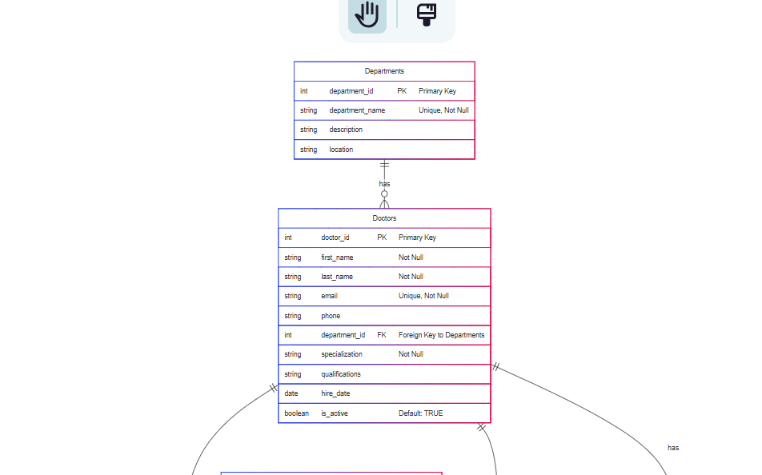
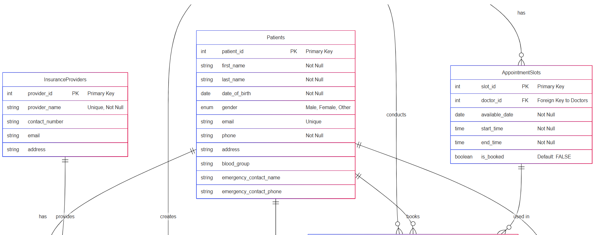
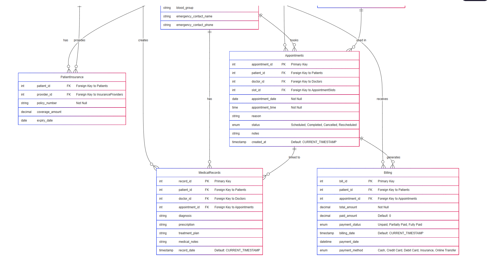

# 🏥 Clinic Booking System

A comprehensive MySQL-based database solution designed to streamline healthcare clinic operations, including patient management, doctor scheduling, appointments, billing, and insurance integration.

---

## 📌 Table of Contents

- [Project Overview](#project-overview)
- [Features](#features)
- [Entity Relationship Diagram (ERD)](#entity-relationship-diagram-erd)
- [Database Entities](#database-entities)
- [Prerequisites](#prerequisites)
- [Installation & Setup](#installation--setup)
  - [Method 1: Using MySQL Workbench](#method-1-using-mysql-workbench)
  - [Method 2: Using Command Line](#method-2-using-command-line)
- [Technologies Used](#technologies-used)

---

## 🧾 Project Overview

The **Clinic Booking System** is a robust database solution built with MySQL to simplify clinic operations. It enables seamless management of:

- Patients & medical records
- Appointments & doctors
- Billing & insurance data

---

## ✨ Features

- 🩺 **Doctor Management**: Track doctor profiles, departments, and specializations  
- 👥 **Patient Profiles**: Maintain comprehensive patient records  
- 📅 **Appointment Scheduling**: Manage doctor availability and appointments  
- 📋 **Medical Records**: Securely store and retrieve diagnosis and treatment history  
- 💰 **Billing System**: Monitor patient billing and payments  
- 🏥 **Department Organization**: Group services into medical departments  
- 💳 **Insurance Integration**: Link patients to their insurance providers  

---

## 📊 Entity Relationship Diagram (ERD)

Visual representation of the database schema:

  
  


---

## 🗃️ Database Entities

| Entity                | Description                                 |
|----------------------|---------------------------------------------|
| **Departments**       | Medical department information              |
| **Doctors**           | Doctor profiles and specialties             |
| **Patients**          | Patient contact and demographic info        |
| **Insurance Providers** | Insurance company details                |
| **Appointment Slots** | Predefined time slots for appointments      |
| **Appointments**      | Booking and scheduling records              |
| **Medical Records**   | Diagnoses, treatments, and visit history    |
| **Billing**           | Transactions and payment history            |

---

## ⚙️ Prerequisites

- [MySQL Server](https://dev.mysql.com/downloads/mysql/) (v8.0 or later)
- [MySQL Workbench](https://www.mysql.com/products/workbench/) (optional but recommended)

---

## 🚀 Installation & Setup

### 1️⃣ Database Creation

- Clone this repository or download the `clinic.sql` file.

### 2️⃣ Import Database

#### Method 1: Using MySQL Workbench

1. Open **MySQL Workbench**
2. Connect to your MySQL server
3. Go to **Server > Data Import**
4. Select **"Import from Self-Contained File"**
5. Browse and choose the `clinic.sql` file
6. Create a new schema or choose an existing one
7. Click **Start Import**

#### Method 2: Using Command Line

```bash
# Connect to MySQL
mysql -u [username] -p

# Create the database
CREATE DATABASE clinic_booking_system;

# Use the database
USE clinic_booking_system;

# Import the SQL file
source /path/to/clinic.sql;
```
---

### 3️⃣ Insert Sample Data

After importing the SQL file, your database will be pre-populated with **sample records** for:

- Patients
- Doctors
- Departments
- Appointment Slots
- Medical Records
- Billing and Insurance

This allows you to test the system immediately without manually adding entries.

If needed, you can edit or extend the sample data by modifying the `clinic.sql` file.

---

## 💻 Technologies Used

The Clinic Booking System was developed using the following technologies:

- 🛢️ **MySQL** — Relational database management system for storing structured data
- 💾 **SQL** — Language used to query, insert, update, and manage the database
- 🧩 **Entity-Relationship Modeling** — For designing logical data relationships and schema structure
- 🧱 **Database Design Principles** — To ensure data integrity, normalization, and scalability

---

## 📬 Contact & Feedback

If you encounter any issues or have suggestions for improvement, feel free to [open an issue](#) or contact the project maintainer at wanguikimberly7@gmail.com.

---


 
